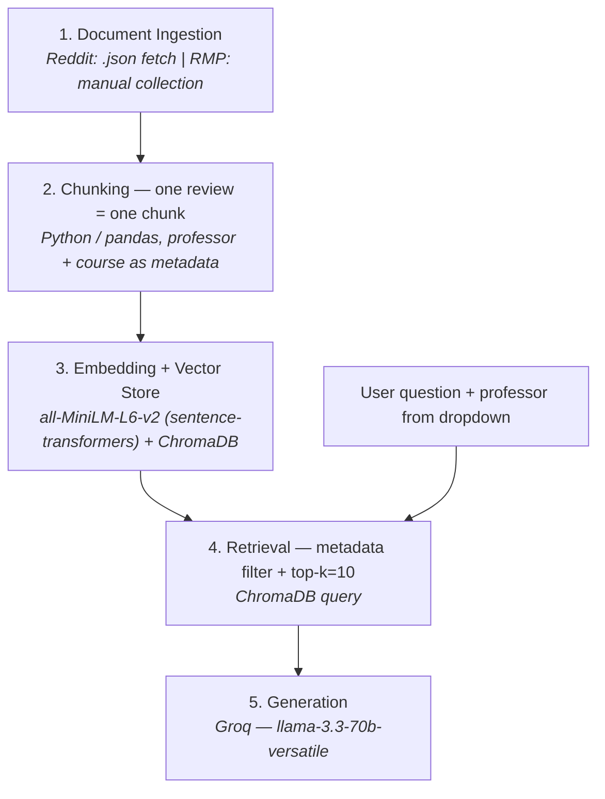

# Project 1 Planning: The Unofficial Guide

> Write this document before you write any pipeline code.
> Your spec and architecture diagram are what you'll use to direct AI tools (Claude, Copilot, etc.) to generate your implementation — the more specific they are, the more useful the generated code will be.
> Update the Retrieval Approach and Chunking Strategy sections if you change your approach during implementation.
> Update this file before starting any stretch features.

---

## Domain

<!-- I chose the best proffesors for CS1 at the University of Central Florida. This information is usually hard to find through offical means because they dont provide honest student reviews from classes-->

---

## Documents

<!-- List your specific sources: URLs, subreddit names, forum threads, or file descriptions.
     Aim for at least 10 sources that together cover different subtopics or perspectives within your domain. -->

**File types:** JSON. RateMyProfessors reviews are pulled via RMP's GraphQL
endpoint and saved as one normalized JSON file per professor in `documents/rmp/`.
Reddit threads are saved as raw `.json` (hand-saved from the browser, since Reddit
blocks automated fetches) in `documents/reddit/raw/` and parsed into normalized
JSON in `documents/reddit/`.

| # | Source | Description | URL or location |
|---|--------|-------------|-----------------|
| 1 | RMP | Tanvir Ahmed reviews (386, 233 are CS1) | https://www.ratemyprofessors.com/professor/2455124 |
| 2 | RMP | Arup Guha reviews (402, 84 CS1) | https://www.ratemyprofessors.com/professor/56125 |
| 3 | RMP | Awrad Ali reviews (40, 18 CS1) | https://www.ratemyprofessors.com/professor/3092502 |
| 4 | RMP | Kurt Kullu reviews (85, 15 CS1) | https://www.ratemyprofessors.com/professor/2977675 |
| 5 | RMP | Md Mahfuzur Rahaman reviews (17, 9 CS1) | https://www.ratemyprofessors.com/professor/3146605 |
| 6 | Reddit | "CS1 Professor recommendations?" | https://www.reddit.com/r/ucf/comments/14mqozd/cs1_professor_recommendations/ |
| 7 | Reddit | "CS1 Professors" | https://www.reddit.com/r/ucf/comments/u70c0s/cs1_professors/ |
| 8 | Reddit | "Advice on Professor for Computer Science 1 (Summer)" | https://www.reddit.com/r/ucf/comments/1rgc1e7/advice_on_professor_for_computer_science_1_summer/ |
| 9 | Reddit | "CS1 professor next semester" | https://www.reddit.com/r/ucf/comments/1pblwwm/cs1_professor_next_semester/ |
| 10 | Reddit | "COP 3502 summer professor" | https://www.reddit.com/r/ucf/comments/1il2o4j/cop_3502_summer_professor/ |

> Note: the original plan listed the same RMP URL for Ahmed and Guha — Guha's
> real id is `56125`, fixed above and verified against the live endpoint.

---

## Chunking Strategy

<!-- How will you split documents into chunks?
     State your chunk size (in tokens or characters), overlap size, and explain why those
     numbers fit the structure of your documents.
     A review-heavy corpus warrants different chunking than a long FAQ. -->

**Chunk size:**
Chunks will varry by length because I aim to make semantic chuncks for each review

**Overlap:**
No overlap becuase we are using semantic chuncks, each chunk whill hold its own context so we dont want to add two reviews that dont really have the same context

**Reasoning:**
All my sources are review based, we want to hold all teh information of one review as its own unit as it could be very simillar to a students query, it wouldnt make sense to parse the page with unified block lenght as we would cut out importnt information, its only use is that its simple in nature but makes it harder to actually get information as the embedings will mess with eachother once the information tries to overlap or loose context

**Implementation result (Milestone 3):** 962 chunks total (926 RMP + 36 Reddit).
Median chunk ≈ 333 chars (~83 tokens), max ≈ 967 chars (~240 tokens, just under
MiniLM's 256-token window so almost no truncation). Content-free placeholder
reviews ("N/A", "No Comments") were dropped; terse-but-real sentiment
("unreasonably hard") was kept as legitimate signal. Reddit comments that mention
multiple professors are fanned out into one chunk per professor (see Challenge 2)
so the scalar metadata filter works the same for both sources.

---

## Retrieval Approach

<!-- Which embedding model are you using (e.g., all-MiniLM-L6-v2 via sentence-transformers)?
     How many chunks will you retrieve per query (top-k)?
     If you were deploying this for real users and cost wasn't a constraint, what tradeoffs
     would you weigh in choosing a different embedding model — context length, multilingual
     support, accuracy on domain-specific text, latency? -->

**Embedding model:**
All-MiniLM-l6-v2 via sentence-transformers

**Top-k:**
k=10-20, we have smaller review chuncks and we wanna give alot of information, if we had
bigger chunks we could use less but we want to aggregate as much information that is needed to asnwer a query, we can also experiment with this feature

**Production tradeoff reflection:**
I would need to weigh if the embedding model can actualy take information from student text and if it is trained on student text and grammatical patterns rather than actual documents, you would have to consider latency specifically when addaptign to live users during the fall and spring start of semesters 

---

## Evaluation Plan

<!-- List your 5 test questions with their expected correct answers.
     Questions should be specific enough that you can judge whether the system's response
     is right or wrong. "What are good dining halls?" is too vague.
     "What do students say about wait times at [dining hall name] during lunch?" is testable. -->

| # | Question | Expected answer |
|---|----------|-----------------|
| 1 |  What Proffesors Provide Extra Credit| Ahmed, Ali, Rah, 
| 2 | Between Ali and Ahmed, who's class seems harder|  Ali|
| 3 |Overall who is the best professor for CS1 for teh | Guha Ahmed|
| 4 | Is Awrad Ali's grading considered fair or harsh|  Fair|
| 5 | In generall how are the professors difficulty for CS1|  Fair|

---

## Anticipated Challenges

<!-- What could go wrong? Name at least two specific risks with reasoning.
     Consider: noisy or inconsistent documents, missing source attribution, off-topic
     retrieval, chunks that split key information across boundaries. -->

1. Problems trying to figure out who is the best between professors as no professor review comes with the tag best, might just spit out different information each time

2. Problems with tryig to capture the professor meta data as if we just store the text information for a review we wont know what professor holds what review

   **How this was handled:** professor identity is stored as scalar metadata, not
   left to the embedding (embeddings capture topic, not reliably who a review is
   about), and retrieval filters on it first. RMP reviews are already per-professor.
   Reddit is the hard case — a reply ("yeah his exams are brutal") may be about a
   professor it never names. The Reddit parser walks the comment tree and inherits
   professor context downward: a comment's professors are its own detected names
   (via an alias map — "ahmed"/"tanvir" etc., with bare "Ali" excluded as too
   common), or, if it names none, the nearest naming ancestor's. Each reply also
   carries a short snippet of its parent comment so the chunk is self-contained.
   **Known limitation:** when an ancestor compares several professors, a
   name-less reply inherits all of them (over-attribution) — e.g. "think he'd be
   good for CS1?" gets tagged with 3 professors. Rare, and accepted for now.

---

## Architecture

<!-- Draw a diagram of your pipeline showing the five stages:
     Document Ingestion → Chunking → Embedding + Vector Store → Retrieval → Generation
     Label each stage with the tool or library you're using.
     You can use ASCII art, a Mermaid diagram, or embed a sketch as an image.
     You'll use this diagram as context when prompting AI tools to implement each stage. -->

---

## AI Tool Plan

<!-- For each part of the pipeline below, describe:
     - Which AI tool you plan to use (Claude, Copilot, ChatGPT, etc.)
     - What you'll give it as input (which sections of this planning.md, which requirements)
     - What you expect it to produce
     - How you'll verify the output matches your spec

     "I'll use AI to help me code" is not a plan.
     "I'll give Claude my Chunking Strategy section and ask it to implement chunk_text()
     with my specified chunk size and overlap" is a plan. -->

**Milestone 3 — Ingestion and chunking:**
Tool: Claude for writing and explaining functions; optionally Copilot for inline autocomplete.
Input: my "Document Ingestion" method notes (Reddit .json fetch with custom User-Agent; manual capped collection for RMP/Coursicle) plus the normalized schema {id, source, professor, course, rating, date, text}, and my "Chunking Strategy" section (one review = one chunk, professor + course as metadata, no overlap between reviews).
Expected output: a fetch_reddit_thread(url) that returns normalized records from the comment tree; a load_manual_csv() that maps my hand-collected rows into the same schema; and a build_chunks(records) that turns each review into one chunk carrying its metadata.
Verify: I'll write the function signatures and docstrings myself first so I own the design, then run each on one known thread and one known professor and eyeball that every output record has the right professor/course/text, that a specific review I recognize appears exactly once, and that no chunk merges two reviews. I'll ask Claude to walk me through how it parses the nested comment JSON so I can explain it back.

**Milestone 4 — Embedding and retrieval:**
Tool: Claude.
Input: my "Embedding + Vector Store" and "Retrieval" sections and the stack (all-MiniLM-L6-v2 via sentence-transformers, ChromaDB, metadata filter by professor, top-k=10).
Expected output: an embed_and_store(chunks) that runs MiniLM over each chunk's text and writes the vector plus metadata into a ChromaDB collection; and a retrieve(query, professor, k=10) that filters to the selected professor's chunks first, then does vector search within them.
Verify: I'll write the retrieve flow (filter → search) myself since it's the conceptual core, then run my own eval questions and confirm the returned chunks are the right professor and relevant aspect. Critically, I'll test my name-blind risk directly: query one professor and confirm no other professor's reviews come back — that proves the metadata filter works. I'll have Claude explain how Chroma's where filter interacts with similarity ranking so I understand why filtering first matters.

**Milestone 5 — Generation and interface:**
Tool: Claude.
Input: the stack (Groq, llama-3.3-70b-versatile), the format retrieve() returns, my eval-question list, and my interface choice (decide: Streamlit is the easy path for a dropdown + question box + answer display; a CLI is the minimal path).
Expected output: a build_prompt(reviews, question) that assembles the retrieved reviews and instructs the model to answer only from them and say "I don't have information on that" when the reviews don't cover it; a call_groq(prompt) wrapper; and the interface wiring the professor dropdown → filter → retrieve → generate → display.
Verify: I'll write the prompt myself (prompt design is a skill I want), then run my full eval set — especially the absence/hallucination questions, confirming it declines when it has no data, and the "best professor" comparison, confirming it behaves as my risk analysis predicted. I'll check answers are grounded in the retrieved reviews, not invented. I'll have Claude explain the Groq API call once, then write later calls myself.
